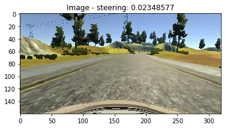
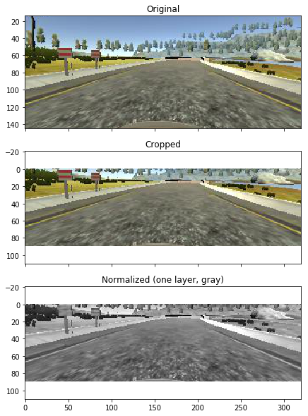

#**Self-Driving Car Nanodegree** 
##**Project 3 - Behavioral Cloning** 
**Ricardo Picatoste**

##Writeup 

**Behavioral Cloning Project**

The goals / steps of this project are the following:

* Use the simulator to collect data of good driving behavior
* Build, a convolution neural network in Keras that predicts steering angles from images
* Train and validate the model with a training and validation set
* Test that the model successfully drives around track one without leaving the road
* Summarize the results with a written report

### Rubric Points

Here I will consider the [rubric points](https://review.udacity.com/#!/rubrics/432/view) individually and describe how I addressed each point in my implementation.  

---
###Files Submitted & Code Quality

####1. Submission includes all required files and can be used to run the simulator in autonomous mode

My project includes the following files:

* model.py containing the script to create and train the model
* drive.py for driving the car in autonomous mode
* utils.py with some pieces of code that I used to generate some plots helping to understand the newtork while creating and training it. 
* model\_ud_data.h5 containing a convolution neural network, trained using the udacity data. 
* model\_my_data.h5 containing a convolution neural network, trained using the udacity data and, in addition, one dataset recorded by me doing the circuit 1 in one direction, another doing it in the reversed direction, and a third one recording recoveries from the side of the road. 
* writeup.md (this file) summarizing the results

####2. Submission includes functional code

Using the Udacity provided simulator and my drive.py file, the car can be driven autonomously around the track.

I generated 2 differentiated sets of weights. Both have the same network architecture, but for the training, I got a set of weights training with the example data provided by udacity, and another one with data recorded by me.

To run the model trained with the sample data, use the line:

    python drive.py model_ud_data.h5

And to run the model trained also with the data recorded by me, use the line: 

    python drive.py model_my_data.h5

####3. Submission code is usable and readable

The model.py file contains the code for training and saving the convolution neural network. The file shows the pipeline I used for training and validating the model, and it contains comments to explain how the code works.

---
###Model Architecture and Training Strategy

####1. An appropriate model architecture has been employed

My model consists of a convolution neural network with the following layers:

* A cropping layer, to remove the non-interesting parts of the image, like the car's hood, and the distracting parts for the neural network, like those above the road. In the utils.py, there is a code cell which will show what can be seen by the network after this layer and also after the next one.

* A Lambda layer for normalization of the input image.  

* A convolution layer with a 5x5 filter, stride of 2 and a depth of 24 layers. The activation at the output is ReLU.

* A convolution layer with a 5x5 filter, stride of 2 and a depth of 36 layers. The activation at the output is ReLU.

* A convolution layer with a 5x5 filter, stride of 2 and a depth of 48 layers. The activation at the output is ReLU.

* A convolution layer with a 3x3 filter, stride of 1 and a depth of 64 layers. The activation at the output is ReLU.

* A convolution layer with a 3x3 filter, stride of 1 and a depth of 64 layers. The activation at the output is ReLU.

* A flatten layer, to start with the fully connected layers.

* A fully connected layer with 100 nodes and ReLU activation.
 
* Immediately after there is a batch normalization layer, to help the training to converge faster, and a dropout layer, to help the network to generalize.

* A fully connected layers with 100 nodes, and again batch normalization and dropout after.

* A fully connected layers with 50 nodes, and again batch normalization and dropout after.

* A fully connected layers with 10 nodes and batch normalization after.

* Finally the output layer with 1 node, and activation function hyperbolic tangent.

####2. Attempts to reduce overfitting in the model

In the network, the means to reduce overfitting has been to use dropout. In addition to this, the way to avoid overfitting has been on the dataset selection, which will be explained in its own point below.  

####3. Model parameter tuning

The model used an adam optimizer, so the learning rate was not tuned manually.

####4. Appropriate training data

Training data has been the hardest part. Actually, realizing that it was the data and not the network the reason for not obtaining a good result, was the hard part.

In the next section the steps followed are explained.  

---
###Model Architecture and Training Strategy

####1. Solution Design Approach

To get the model architecture I started by using the simple networks used by Daniel in the lesson of the course corresponding to this project. It seemed to somehow train and then try to steer the car, but the result was not good. After that I started trying to improve the network by increasing complexity, but the losses did not seem to decrease as expected. With losses achieved at this point, the car was not able to start the circuit.

Then I decided to try the referenced NVIDIA network. At the beginning I did not consider it because I assumed that being a network that has driven a real car, it would be way more complex that what is really needed in this project. But I found that several people had used and recommended using it, and claiming that it was not that hard to train. I tried it, but again the result was not good. 

So far I had been using only the dataset 

filter by angle, eliminate the 0 angle
desperate i did the tool to see the view of the network
First layer reduced to 100 
tanh output 

 

My first step was to use a convolution neural network model similar to the ... I thought this model might be appropriate because ...

In order to gauge how well the model was working, I split my image and steering angle data into a training and validation set. I found that my first model had a low mean squared error on the training set but a high mean squared error on the validation set. This implied that the model was overfitting. 

To combat the overfitting, I modified the model so that ...

Then I ... 

The final step was to run the simulator to see how well the car was driving around track one. There were a few spots where the vehicle fell off the track... to improve the driving behavior in these cases, I ....

At the end of the process, the vehicle is able to drive autonomously around the track without leaving the road.

####2. Final Model Architecture

The final model architecture (model.py lines 18-24) consisted of a convolution neural network with the following layers and layer sizes ...

Here is a visualization of the architecture (note: visualizing the architecture is optional according to the project rubric)

![alt text][image1]

####3. Creation of the Training Set & Training Process

To capture good driving behavior, I first recorded two laps on track one using center lane driving. Here is an example image of center lane driving:

![alt text][image2]

I then recorded the vehicle recovering from the left side and right sides of the road back to center so that the vehicle would learn to .... These images show what a recovery looks like starting from ... :

![alt text][image3]
![alt text][image4]
![alt text][image5]

Then I repeated this process on track two in order to get more data points.

To augment the data sat, I also flipped images and angles thinking that this would ... For example, here is an image that has then been flipped:

Etc ....

After the collection process, I had X number of data points. I then preprocessed this data by ...

I finally randomly shuffled the data set and put Y% of the data into a validation set. 

I used this training data for training the model. The validation set helped determine if the model was over or under fitting. The ideal number of epochs was Z as evidenced by ... I used an adam optimizer so that manually training the learning rate wasn't necessary.

