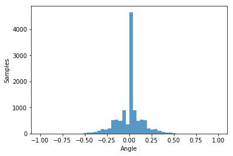
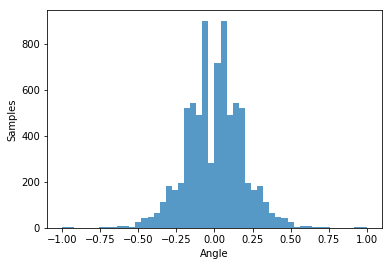

#**Self-Driving Car Nanodegree** 
##**Project 3 - Behavioral Cloning** 
**Ricardo Picatoste**

##Writeup 

**Behavioral Cloning Project**

The goals / steps of this project are the following:

* Use the simulator to collect data of good driving behavior
* Build, a convolution neural network in Keras that predicts steering angles from images
* Train and validate the model with a training and validation set
* Test that the model successfully drives around track one without leaving the road
* Summarize the results with a written report

### Rubric Points

Here I will consider the [rubric points](https://review.udacity.com/#!/rubrics/432/view) individually and describe how I addressed each point in my implementation.  

---
###Files Submitted & Code Quality

####1. Submission includes all required files and can be used to run the simulator in autonomous mode

My project includes the following files:

* model.py containing the script to create and train the model
* drive.py for driving the car in autonomous mode
* utils.py with some pieces of code that I used to generate some plots helping to understand the newtork while creating and training it. 
* model\_ud_data.h5 containing a convolution neural network, trained using the udacity data. 
* model\_my_data.h5 containing a convolution neural network, trained using the udacity data and, in addition, one dataset recorded by me doing the circuit 1 in one direction, another doing it in the reversed direction, and a third one recording recoveries from the side of the road. 
* writeup.md (this file) summarizing the results

####2. Submission includes functional code

Using the Udacity provided simulator and my drive.py file, the car can be driven autonomously around the track.

I generated 2 differentiated sets of weights. Both have the same network architecture, but for the training, I got a set of weights training with the example data provided by udacity, and another one with data recorded by me.

To run the model trained with the sample data, use the line:

    python drive.py model_ud_data.h5

And to run the model trained also with the data recorded by me, use the line: 

    python drive.py model_my_data.h5

####3. Submission code is usable and readable

The model.py file contains the code for training and saving the convolution neural network. The file shows the pipeline I used for training and validating the model, and it contains comments to explain how the code works.

---
###Model Architecture and Training Strategy

####1. An appropriate model architecture has been employed

My model consists of a convolution neural network with the following layers:

* A cropping layer, to remove the non-interesting parts of the image, like the car's hood, and the distracting parts for the neural network, like those above the road. In the utils.py, there is a code cell which will show what can be seen by the network after this layer and also after the next one.

* A Lambda layer for normalization of the input image.  

* A convolution layer with a 5x5 filter, stride of 2 and a depth of 24 layers. The activation at the output is ReLU.

* A convolution layer with a 5x5 filter, stride of 2 and a depth of 36 layers. The activation at the output is ReLU.

* A convolution layer with a 5x5 filter, stride of 2 and a depth of 48 layers. The activation at the output is ReLU.

* A convolution layer with a 3x3 filter, stride of 1 and a depth of 64 layers. The activation at the output is ReLU.

* A convolution layer with a 3x3 filter, stride of 1 and a depth of 64 layers. The activation at the output is ReLU.

* A flatten layer, to start with the fully connected layers.

* A fully connected layer with 100 nodes and ReLU activation.
 
* Immediately after there is a batch normalization layer, to help the training to converge faster, and a dropout layer, to help the network to generalize.

* A fully connected layers with 100 nodes, and again batch normalization and dropout after.

* A fully connected layers with 50 nodes, and again batch normalization and dropout after.

* A fully connected layers with 10 nodes and batch normalization after.

* Finally the output layer with 1 node, and activation function hyperbolic tangent.

####2. Attempts to reduce overfitting in the model

In the network, the means to reduce overfitting has been to use dropout. In addition to this, the way to avoid overfitting has been on the dataset selection, which will be explained in its own point below.  

####3. Model parameter tuning

The model used an adam optimizer, so the learning rate was not tuned manually.

####4. Appropriate training data

Training data has been the hardest part. Actually, realizing that it was the data and not the network the reason for not obtaining a good result, was the hard part.

In the next section the steps followed are explained.  

---
###Model Architecture and Training Strategy

####1. Solution Design Approach

To get the model architecture I started by using the simple networks used by Daniel in the lesson of the course corresponding to this project. It seemed to somehow train and then try to steer the car, but the result was not good. After that I started trying to improve the network by increasing complexity, but the losses did not seem to decrease as expected. With losses achieved at this point, the car was not able to start the circuit.

Then I decided to try the referenced NVIDIA network. At the beginning I did not consider it because I assumed that being a network that has driven a real car, it would be way more complex that what is really needed in this project. But I found that several people had used and recommended using it, and claiming that it was not that hard to train. I tried it, but again the result was not good. At this point I looked for implementations of the same network from other people, and found some interesting ones in github, but after trying them in my code, the situation was the same.

So far I had been using only the dataset from the samples, and after reading multiple posts in the forum advising about this project, it became clear that the data should be improved. I recorded myself doing the circuit forward and backward, and also going to the sides in order to record the recoveries from the sides. After doing this, the situation did not improve at all. A bit in despair I produced the bits of code in utils.py in order to understand if the cropping and normalizing was properly done:

The image seems correctly pre-processed. Another advice I found was to equalize the samples per steering angle. After seeing that I plot the histogram of steering angles:
  

It is clear that there is an excess of angles being 0 or very close. I removed enough to get a more equalized data set:

Once training with this, the car started to behave better, but not yet doing much of the circuit. The next step was to augment data to help the network going far from the sides. For this I used, as suggested in the course, the lateral cameras with some fictional angle added to "come back" from the sides. After some tuning of this parameter, I got the car doing a full lap. 

To improve the behavior, I tried different numbers of epochs, since again in the forum I found that this system is particularly sensitive to many epochs. I found that 9 epochs yielded a smooth behavior in the track.  

A very important part of the final network has been the use of the hyperbolic tangent at the output. My interpretation of this is that such activation limits the control action (the steering angle applied), smoothing the output applied to the car. With it, and the datasets, epochs and so on found in the code, the car can finish the laps with a nice behavior. If only that activation is removed and the same training performed, the car will do part of the track, but far from a complete lap.

Finally I also reduced the first fully connected layer of the NVIDIA architecture (the one in which the final version is based) from 1164 neurons to 100. I did this because the original size of the network is meant for a real car dealing with many more data and situations, and in this project it would lead only to overfit.

####2. Final Model Architecture

The final architecture is the one presented already, and in the previous point the steps followed to arrive to it are commented.

####3. Creation of the Training Set & Training Process

In the point 1 of this section I explained how the data was found to be crucial in obtaining a good behavior of the car. 

The data used have been the sample data from udacity, and 2 laps recorded by me (one on each direction) and some recordings of recoveries. 

The augmentation have been, for the samples with steering angles near zero, to use the side cameras adding a fictitious angle to come back to the center of the road. And for the samples with steering angle above a threshold, to flip them. 

One model have been trained with only the sample data from udacity, applying the mentioned augmentation. In this way the best result was obtained, presented in the video submitted with this project. The system has also been trained with all the datasets explained, obtaining also good results with a car that can do the full lap. Both sets of weights ares submitted. 